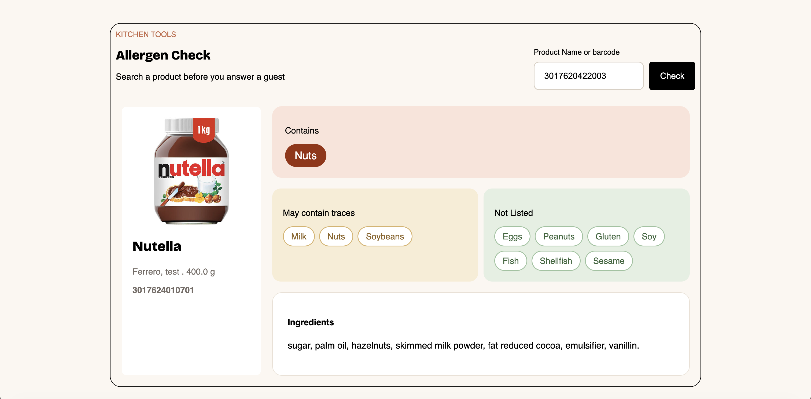

# Allergen Check

A lightweight front-end app that helps users check allergen information for packaged food products. The app searches by product name or barcode and retrieves product data from the Open Food Facts API to show allergens, trace warnings, and ingredients.

## Demo

## Features

- Search for a product by barcode
- Display product image, brand, quantity, and barcode
- Show ingredients that contain allergens
- Highlight possible trace allergens
- Compare results against common allergens and display a "not listed" section
- Clean, single-page interface for quick checks

## Tech Stack

- HTML
- CSS
- JavaScript
- Open Food Facts API

## Project Structure

- `index.html` - main app markup
- `css/style.css` - styling for the interface
- `js/main.js` - API logic and rendering for allergen results
- `data/sample.json` - sample product data
- `image/Demo.png` - screenshot of the working app

## Notes

This project demonstrates how a front-end app can use a public API to turn product data into a useful, everyday tool for allergy awareness.

